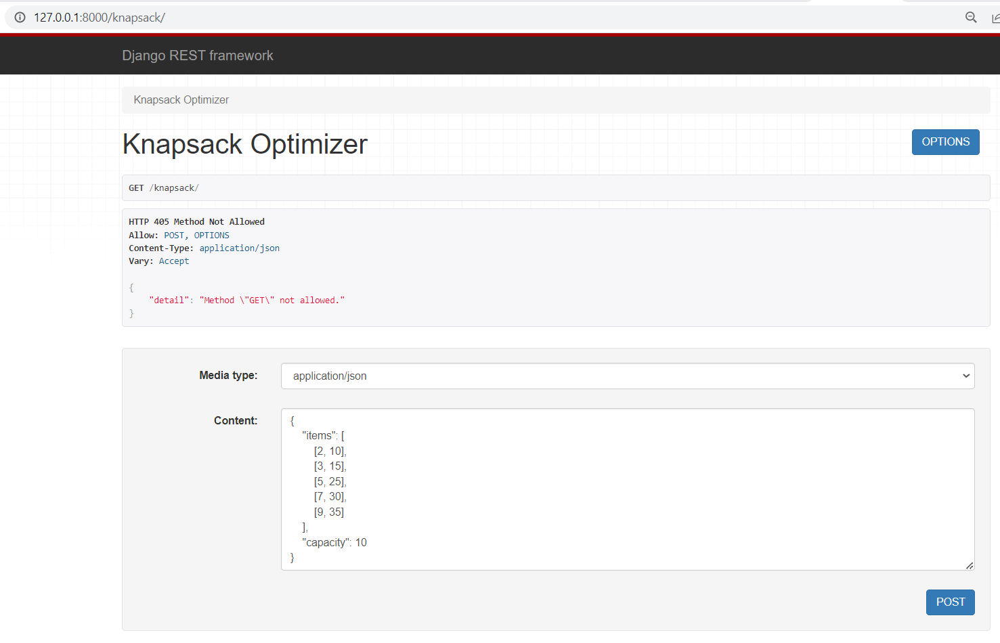
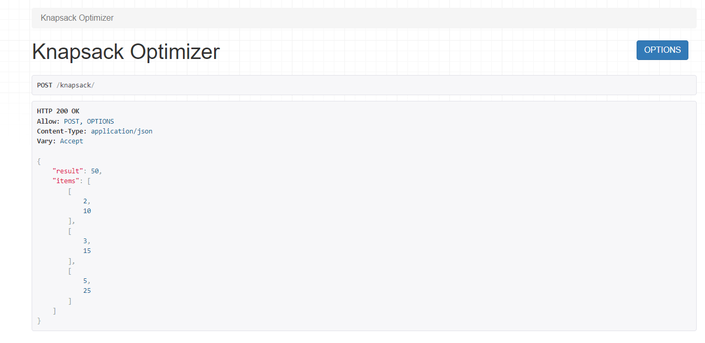
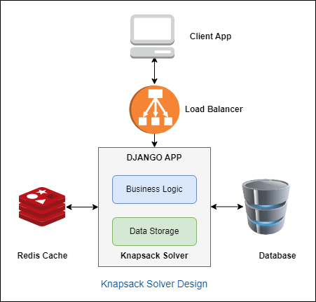

# Knapsack Optimizer Service

> This is a web service developed using Django and Django Rest Framework, provides an API for solving the knapsack problem. 
Given a set of items with weights and values, and a knapsack with a maximum capacity, the service will determine the optimal set 
of items to include in the knapsack to maximize the total value.
>The knapsack django web service/application is built and containerized using docker compose.
>The Dockerfile will create an image and install all the prerequisites required for the Django application.

# Getting Started
> To get started with the Knapsack Optimizer Service, you'll need to follow these steps:
Clone the repository to your local machine:
```sh
$ git clone <repo_url>
```

## To setup dev environment and run the application
>Navigate to knapsack-optimiser directory and execute the below commands

```sh
$ docker-compose build
$ docker-compose up
```

# API Usage 
> Once the docker container created and is running successfully, Navigate to below url
>`http://127.0.0.1:8000/knapsack/` 
> and pass the below json data in the content and media type as application/json as shown below
>

```json
{
    "items": [
        [2, 10],
        [3, 15],
        [5, 25],
        [7, 30],
        [9, 35]
    ],
    "capacity": 10
}
```


>Click on POST to get the response of the capacity with items and values and sample response is shown below

```json
{
    "result": 50,
    "items": [
        [2,10],
        [3,15],
        [5,25]
    ]
}

```



>In this way, a knapsack optimiser service can be created using Django application and containerized using docker compose

>This application can be deployed to Cloud with additional services like LoadBalancer, Redis Cache, Firewall and Authorization Server etc.
>Load balancer is used to distribute traffic to multiple instances of Django Application coming from the client app.
>Redis cache is used to store the frequent API calls, decrease data access latency, increase throughput, and ease the load off your database and application.  




# Instructions to create a Django project(Not required if you are running the application using docker compose)
>
>From the command line, cd into a directory where you’d like to store your code, then run the following command:
>
 
```sh
$ django-admin startproject knapsack_optimiser
```

> Then create an Django App 
> Navigate inside the directory and run the following command
>

```sh
$ python manage.py startapp knapsack_api
```
>

> Navigate to settings.py and add "rest_framework" and "knapsack_api" to INSTALLED_APPS
>
> Refer to the code inside the repo and modify accordingly as per your requirement!
>
> After you make changes, run the migrations to create a fields in the database

```sh
$ python manage.py makemigrations
$ python manage.py migrate
```

# Structure of the Repository

```
knapsack_optimiser/
    knapsack_optimiser/
        settings.py - Django Settings
        urls.py - Url's created to be added here
        .....
        .....
    knapsack_api/
        admin.py - Admin settings to be added here
        knapsack.py - Core Logic
        views.py - middleware
        urls.py - Urls specific to this knapsack_api app
        serializers.py - To serialize the data in to required datatype
    manage.py - Create migrations, users and admin operations
    requirements.txt - Libraries required for this web service
    DockerFile - Instructions to create a Docker image
    docker-compose.yml - To build and run the application
