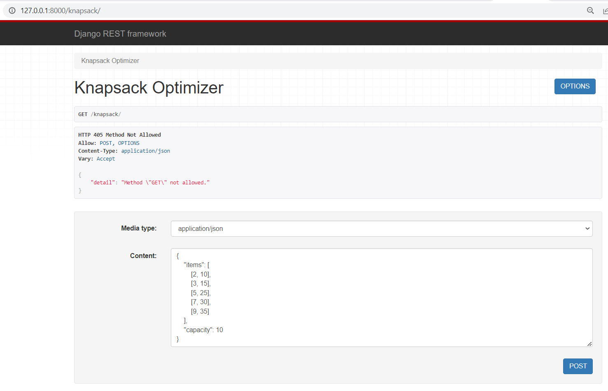
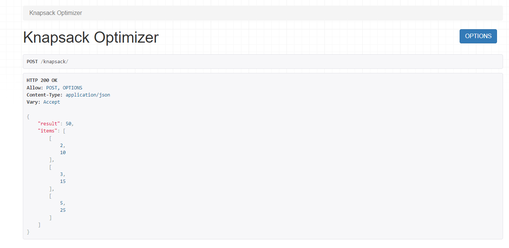

# ReadMe

>This repository tells how to build a knapsack optimizer service using Python Django application
>
>The knapsack django web service/application is containerized using docker compose. 
>
>The Dockerfile will create an image and install all the prerequisites required for the Django application.
>
>To 

## To setup dev environment and run the application
```sh
$ docker-compose build
$ docker-compose up
```

>Once the docker container created and is running successfully, Navigate to below url
>
>`http://127.0.0.1:8000/knapsack/` 
> and pass the below json data in the content and media type as application/json
>


```json

{
    "items": [
        [2, 10],
        [3, 15],
        [5, 25],
        [7, 30],
        [9, 35]
    ],
    "capacity": 10
}

```

>Click on POST to get the response of the capacity with items and values and sample response is shown below

```json

{
    "result": 50,
    "items": [
        [2,10],
        [3,15],
        [5,25]
    ]
}

```



>In this way, a knapsack service can be created using Django application and containerized using docker compose

>This application can be deployed to cloud with components like LoadBalancer, Redis Cache, Firewall and Authorization Server etc.
>
>Load balancer is used to distribute traffic to multiple instances of Django Application coming from the client application. 
>
>Redis cache is used to store the frequent API calls and retrieve the most used data from it.  